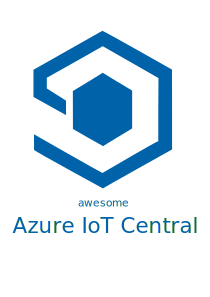

	

		
	

	 
	 
	
	 
	

    Awesome <a href="https://azure.microsoft.com/en-in/services/iot-central/">Azure IoT Central</a> is an awesome style list that curates the best samples, libraries, tools, tutorials, articles and more for Azure IoT Central, Azure SaaS solution to connect, monitor and manage your IoT assets at scale.
	

	 

## Contents
- [Contents](#contents)
- [What is Azure IoT Central](#what-is-azure-iot-central)
  - [Overview of Azure IoT Central](#overview-of-azure-iot-central)
  - [Overview of IoT Plug and Play](#overview-of-iot-plug-and-play)
  - [Digital Twins Definition Language](#digital-twins-definition-language)
  - [Connect Azure IoT Edge Devices](#connect-azure-iot-edge-devices)
- [SDKs and samples](#sdks-and-samples)
  - [Python](#python)
  - [Node.js](#nodejs)
  - [Java](#java)
  - [Mobile](#mobile)
- [Edge](#edge)
- [Mobile Integrations](#mobile-integrations)
- [Projects and tutorials](#projects-and-tutorials)
- [Device Firmwares](#device-firmwares)
- [Command Line Tools](#command-line-tools)
- [Integration Tools](#integration-tools)
- [Simulation Tools](#simulation-tools)
- [Videos](#videos)

## What is Azure IoT Central
Azure IoT Central is an Application Platform that offers incredibly powerful tools and capabilities for you to bootstrap and integrate your IoT projects and scenarios. It is designed to get you up and running quickly with sophisticated visualizations, device management, rules engine, modeling, data exporting and much more.
### Overview of Azure IoT Central
If you are new to Azure IoT Central, we have collected up a set of links to help you get up to speed on the high level topics and introduction to the application platform.
- [Overview of Azure IoT Central](https://docs.microsoft.com/en-us/azure/iot-central/core/overview-iot-central)
### Overview of IoT Plug and Play
IoT Plug and Play enables solution builders to integrate smart devices with their solutions without any manual configuration. At the core of IoT Plug and Play, is a device model that a device uses to advertise its capabilities to an IoT Plug and Play-enabled application. Azure IoT Central implements the "Digital Twins Definition Language" and offers powerful modeling capabilities for building IoT solutions on the application platform. It can be a simplistic as a sensor measuring ambient temperature; to scaling up to the complexity of a industrial manufacturing floor full of diverse equipment and PLC's.
- [Overview IoT Plug and Play](https://docs.microsoft.com/en-us/azure/iot-pnp/overview-iot-plug-and-play)
### Digital Twins Definition Language
The Digital Twins Definition Language (DTDL) is a language for describing models and interfaces for IoT digital twins.
- [Digital Twins Definition Language](https://github.com/Azure/opendigitaltwins-dtdl)
### Connect Azure IoT Edge Devices
Get started connecting Edge Devices to Azure IoT Central
- [Connect Azure IoT Edge Devices to an Azure IoT Central](https://docs.microsoft.com/en-us/azure/iot-central/core/concepts-iot-edge)
## SDKs and samples
### Python
- [Repo with samples](https://github.com/iot-for-all/iotc-python-client)
- [Releases](https://pypi.org/project/iotc/)
- [Device Sample](https://github.com/iot-for-all/Iot_Central_Python_Sample)
- [Docs](https://docs.microsoft.com/en-us/azure/iot-central/core/tutorial-connect-device-python)
### Node.js
- [Repo with samples](https://github.com/lucadruda/iotc-nodejs-device-client)
- [Releases](https://www.npmjs.com/package/azure-iotcentral-device-client)
- [Docs](https://docs.microsoft.com/en-us/azure/iot-central/core/tutorial-connect-device-nodejs)
### Java
- [Repo](https://github.com/lucadruda/iotc-java-device-client)
- [Samples](https://github.com/lucadruda/iotc-samples/tree/master/java)
- [Releases](https://search.maven.org/artifact/com.github.lucadruda/iotc-java-device-client)
### Mobile
- [Repo (React Native)](https://github.com/lucadruda/iotc-react-native-device-client)
- [Releases](https://www.npmjs.com/package/react-native-azure-iotcentral-client)
- [Android Sample (Java)](https://github.com/Azure/iotc-android-sample)
## Edge
- [Azure IoT Edge on Kubernetes Connected to IoT Central](https://microsoft.github.io/iotedge-k8s-doc/examples/iotcentraltutorial.html)
- [Azure IoT Central Edge Hands On Labs With Edge Enabled MarketPlace Linux VM](https://github.com/rangv/azureiotcentraledgelinux)
- [Azure IoT Edge on CentOS Connected to IoT Central](https://rangv.github.io/azureiotedgewithcentralcentos/)
- [Industrial IoT Gateway Installer](https://github.com/Azure/Industrial-IoT-Gateway-Installer)
## Mobile Integrations
- [Continuous Patient Monitoring Sample](https://github.com/iot-for-all/iotc-cpm-sample)
## Projects and tutorials
- [Develop with Sphere and Azure RTOS](https://docs.microsoft.com/en-us/learn/modules/develop-secure-iot-solutions-azure-sphere-iot-central/)
- [Azure IoT Central Public API Authentication and Authorization](https://github.com/iot-for-all/iotc-aad-setup)
## Device Firmwares
- [Repo](https://github.com/Azure/iot-central-firmware)
## Command Line Tools
- [Azure CLI IoT Extension](https://github.com/Azure/azure-iot-cli-extension#microsoft-azure-iot-extension-for-azure-cli)
## Integration Tools
- [Device Bridge](https://github.com/Azure/iotc-device-bridge)
- [Notification Bridge](https://github.com/lucadruda/iotc-notification-bridge)
- [Edge enabled VM](https://github.com/iot-for-all/iotc-edgemodule-vm-deploy)
- [Node-RED node](https://flows.nodered.org/node/node-red-contrib-azure-iot-device)
## Simulation Tools
- [mock-devices](https://github.com/codetunez/mock-devices)
## Videos
- [IoT Show](https://aka.ms/iotshow)
